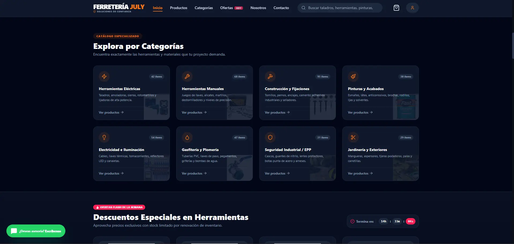
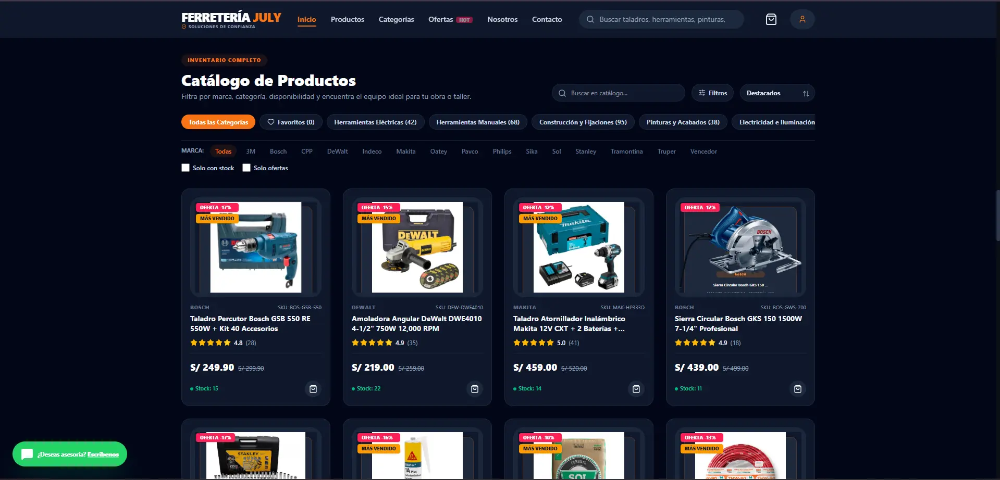
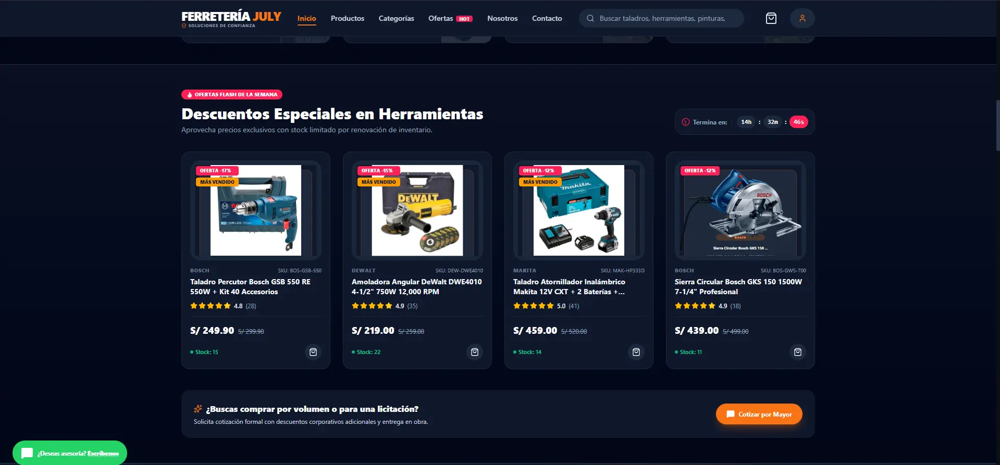
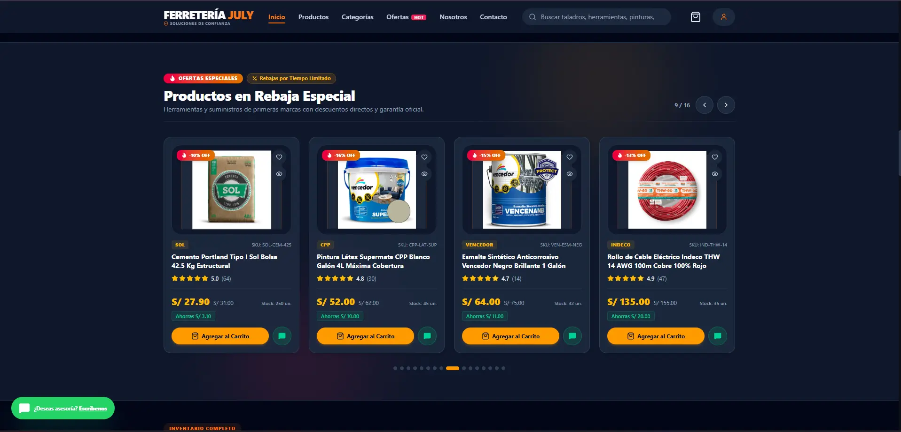
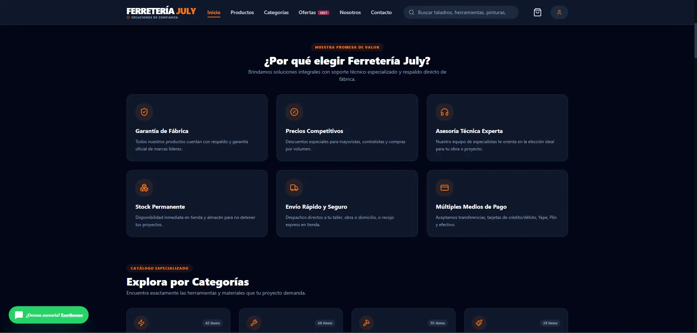
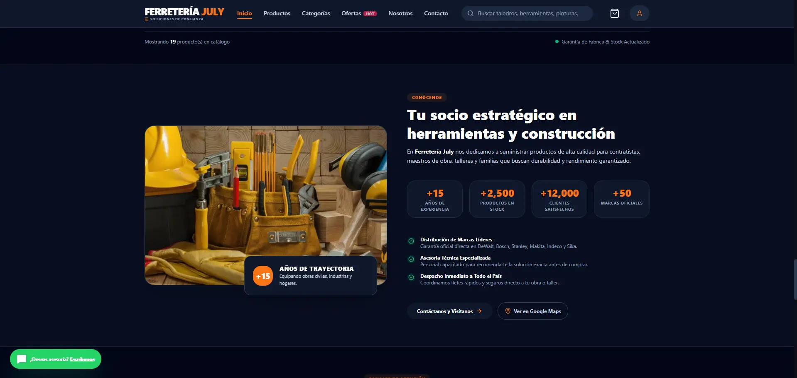
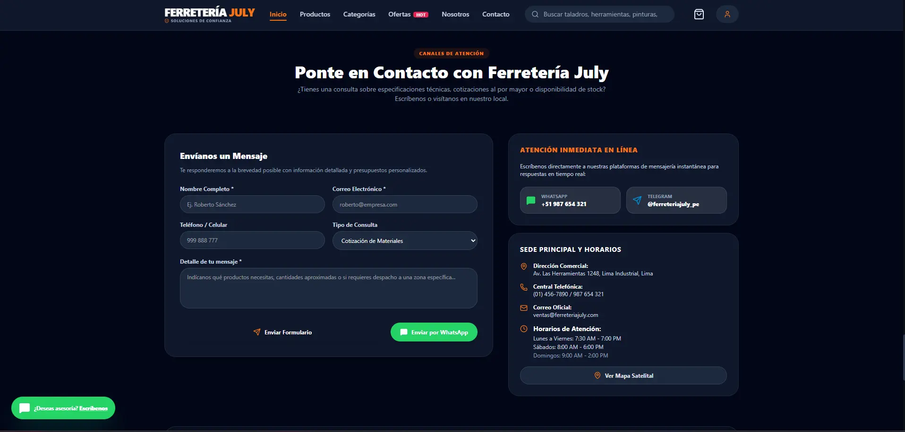
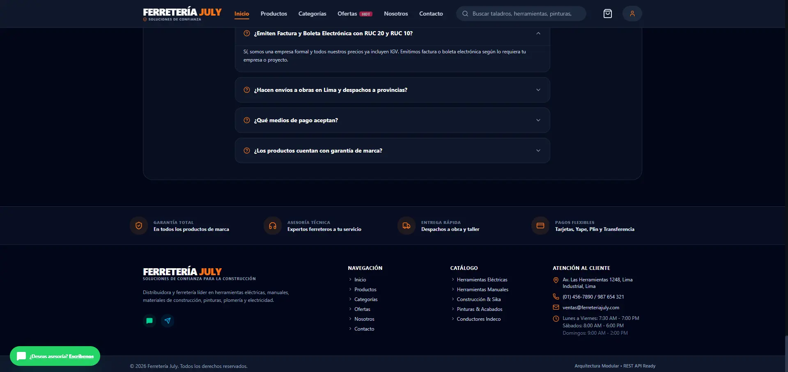

<div align="center">
  <h1>🏪 Ferretería July</h1>
  <h3>Landing page comercial para catálogo, promociones y cotizaciones por WhatsApp</h3>
  
  <br>
  
  <p>
    <a href="https://github.com/wanglingtech/LandingPage_Ferreteria">
      
    </a>
    <a href="https://landing-page-ferreteria-nine.vercel.app">
      
    </a>
    
    
  </p>
  
  <p>
    
    
    
    
  </p>
</div>

---

## 📸 Vista Previa

<div align="center">
  <table>
    <tr>
      <td align="center" width="50%"><strong>🏠 Inicio</strong></td>
      <td align="center" width="50%"><strong>📂 Categorías</strong></td>
    </tr>
    <tr>
      <td></td>
      <td></td>
    </tr>
    <tr>
      <td align="center"><strong>🛒 Catálogo</strong></td>
      <td align="center"><strong>🏷️ Descuentos Especiales</strong></td>
    </tr>
    <tr>
      <td></td>
      <td></td>
    </tr>
    <tr>
      <td align="center"><strong>💰 Productos en Rebaja</strong></td>
      <td align="center"><strong>⭐ Valor Ferretería</strong></td>
    </tr>
    <tr>
      <td></td>
      <td></td>
    </tr>
    <tr>
      <td align="center"><strong>👥 Conócenos</strong></td>
      <td align="center"><strong>📞 Contacto</strong></td>
    </tr>
    <tr>
      <td></td>
      <td></td>
    </tr>
    <tr>
      <td align="center" colspan="2"><strong>📌 Footer</strong></td>
    </tr>
    <tr>
      <td colspan="2"></td>
    </tr>
  </table>
</div>

---

## 🎯 Descripción

**Ferretería July** es una landing page moderna, responsive y orientada a conversión para una ferretería peruana. Presenta la marca, sus categorías, productos destacados, ofertas y canales de contacto en una sola experiencia web.

Más que una página informativa, funciona como un **catálogo interactivo**: el visitante puede buscar productos, revisar detalles, guardar favoritos, armar un carrito y enviar una solicitud de cotización o pedido directamente por WhatsApp.

> **📌 Alcance actual:** Frontend demostrativo con datos mock y persistencia local del navegador. Preparado para evolucionar hacia una API y sistema de inventario real.

---

## ✨ Funcionalidades

| Ícono | Característica   | Descripción                                                         |
| ----- | ---------------- | ------------------------------------------------------------------- |
| 🏠    | **Hero**         | Llamadas a la acción para explorar catálogo y solicitar precios     |
| 📦    | **Catálogo**     | Búsqueda en tiempo real, categorías, productos destacados y ofertas |
| 🔍    | **Vista rápida** | Modal de detalle con especificaciones, precio, stock y reseñas      |
| 🛒    | **Carrito**      | Persistente con cálculo de cantidades, descuentos y total estimado  |
| 💬    | **WhatsApp**     | Generación de mensajes de consulta y pedido directo                 |
| ⭐    | **Favoritos**    | Persistencia en `localStorage`                                      |
| 👤    | **Usuario**      | Registro e inicio de sesión demostrativos                           |
| 📱    | **Diseño**       | Responsive, modo claro/oscuro y navegación móvil                    |
| 🔍    | **SEO**          | Metaetiquetas, Open Graph y keywords optimizadas                    |

---

## 🛠️ Tecnologías Utilizadas

### Frontend

<div align="center">
  <table>
    <tr>
      <td align="center" width="25%">
        <br>
        <strong>React 19</strong>
      </td>
      <td align="center" width="25%">
        <br>
        <strong>TypeScript</strong>
      </td>
      <td align="center" width="25%">
        <br>
        <strong>Vite 6</strong>
      </td>
      <td align="center" width="25%">
        <br>
        <strong>Tailwind CSS 4</strong>
      </td>
    </tr>
  </table>
</div>

### Librerías y Herramientas

- 🎨 **Lucide React** - Iconografía consistente
- 🎬 **Motion** - Transiciones y animaciones
- 📦 **localStorage** - Persistencia de datos
- 🌐 **Node.js** + **npm** - Entorno de desarrollo
- 🏗️ **Arquitectura por componentes** - Servicios y mocks separados

---

## 📁 Estructura del Proyecto

```text
.
├── assets/                 # Recursos visuales del proyecto
│   ├── captures/           # Capturas de pantalla para README
│   └── img/                # Logos e imágenes de marca
├── src/
│   ├── components/         # Layout, home, productos, carrito, autenticación
│   │   ├── layout/         # Header, Footer, navegación
│   │   ├── home/           # Hero, categorías, ofertas, beneficios
│   │   ├── products/       # Catálogo, detalles, filtros
│   │   ├── cart/           # Carrito, checkout
│   │   └── auth/           # Login, registro
│   ├── config/             # Configuración de marca y contacto
│   ├── mocks/              # Banners, categorías, productos y reseñas
│   ├── models/             # Interfaces y tipos TypeScript
│   ├── services/           # Carrito, favoritos, autenticación, productos
│   └── utils/              # Utilidades compartidas
├── index.html              # Metadatos SEO y punto de entrada
├── vite.config.ts          # Configuración de Vite y Tailwind
└── package.json            # Scripts y dependencias
```

## 🚀 Instalación y Ejecución Local

---

- Requisitos previos
- Node.js 18 o superior
- npm 9 o superior
- Git

---

## Pasos

```bash
# Clonar el repositorio
git clone https://github.com/wanglingtech/LandingPage_Ferreteria.git

# Entrar al directorio
cd LandingPage_Ferreteria

# Instalar dependencias
npm install

# Iniciar servidor de desarrollo
npm run dev
```

Abre http://localhost:3000 en tu navegador.

## Scripts disponibles

```bash
npm run dev      # Inicia Vite en desarrollo
npm run lint     # Comprueba tipos TypeScript
npm run build    # Genera la versión de producción en dist/
npm run preview  # Sirve localmente la compilación de producción
```

## ⚙️ Configuración de Datos

Los datos de contacto, enlaces sociales, horarios, moneda, beneficios y estadísticas se centralizan en: 📁 src/config/site.config.ts

Antes de publicar, reemplaza los datos de ejemplo por los datos reales del negocio, especialmente:

- 📞 Teléfono
- 📍 Dirección
- ✉️ Correo
- 💬 WhatsApp
- 🌐 Redes sociales

Las imágenes de productos y banners de demostración están definidas en src/mocks/. Verifica que tengas permiso para usar imágenes de terceros o sustitúyelas por fotografías propias y optimizadas.

## 📄 Licencia

---

Este proyecto está bajo la Licencia MIT - una licencia permisiva que permite:

✅ Uso comercial del proyecto
✅ Modificación del código fuente
✅ Distribución de copias del proyecto
✅ Sublicencia del proyecto

---

## Requisito: Mantener el aviso de copyright y la licencia en todas las copias.

<details> <summary><strong>📋 Ver texto completo de la Licencia MIT</strong></summary>
MIT License

Copyright (c) 2024 WangLing Tech

Permission is hereby granted, free of charge, to any person obtaining a copy
of this software and associated documentation files (the "Software"), to deal
in the Software without restriction, including without limitation the rights
to use, copy, modify, merge, publish, distribute, sublicense, and/or sell
copies of the Software, and to permit persons to whom the Software is
furnished to do so, subject to the following conditions:

The above copyright notice and this permission notice shall be included in all
copies or substantial portions of the Software.

THE SOFTWARE IS PROVIDED "AS IS", WITHOUT WARRANTY OF ANY KIND, EXPRESS OR
IMPLIED, INCLUDING BUT NOT LIMITED TO THE WARRANTIES OF MERCHANTABILITY,
FITNESS FOR A PARTICULAR PURPOSE AND NONINFRINGEMENT. IN NO EVENT SHALL THE
AUTHORS OR COPYRIGHT HOLDERS BE LIABLE FOR ANY CLAIM, DAMAGES OR OTHER
LIABILITY, WHETHER IN AN ACTION OF CONTRACT, TORT OR OTHERWISE, ARISING FROM,
OUT OF OR IN CONNECTION WITH THE SOFTWARE OR THE USE OR OTHER DEALINGS IN THE
SOFTWARE.

</details>

## 👨‍💻 Autor

<div align="center">  <h3>WangLing Tech</h3> <p><em>Desarrollador Full-Stack</em></p> <p> <a href="https://github.com/wanglingtech">  </a> <a href="https://www.linkedin.com/in/kevin-villegas-solis-7b0038366/">  </a> <a href="mailto:kevinvillegas.dev@gmail.com">  </a> <a href="https://www.youtube.com/@wanglingtech">  </a> </p> </div>
<div align="center"> <p>Hecho con ❤️ usando TypeScript, React y dedicación para <strong>Ferretería July</strong></p> <p>    </p> </div> ```
